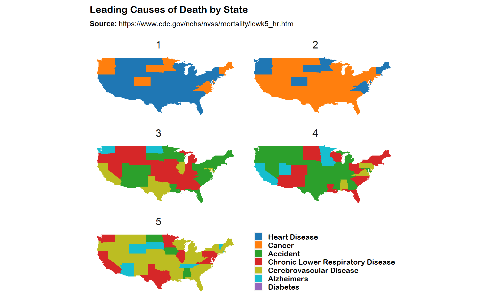
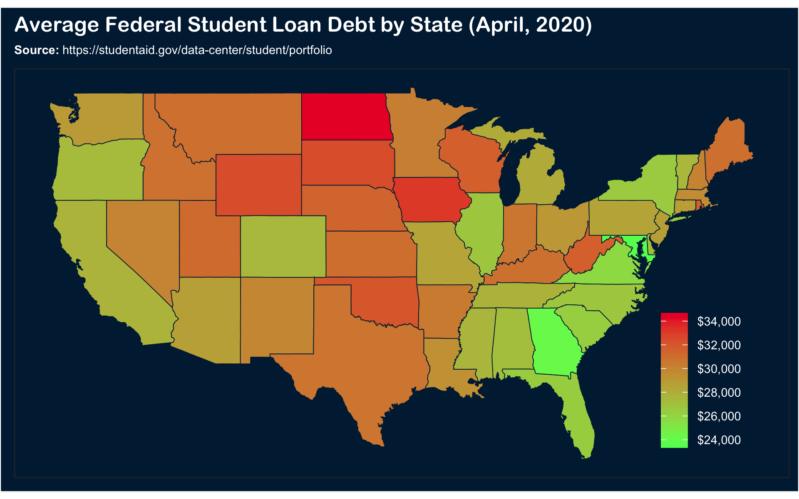

Hello there! :wave:

I'm Gavin! A Mathematician, Statistician, and Data Scientist based out of Denver, CO.

This GitHub page is a continually growing list of my personal projects.

Feel free to follow me on GitHub or <a href="https://www.linkedin.com/in/gavin-armstrong-10/">LinkedIn</a>.

Current GitHub projects:

1. Leading Causes of Death by State.

https://github.com/GavArmstrong/Causes_of_Death

2. Drug poisoning Mortality Rate by County.

https://github.com/GavArmstrong/Drug_Poisoning_Mortatlity

3. Average Federal Student Loan Debt by State.

https://github.com/GavArmstrong/Student_Loans

